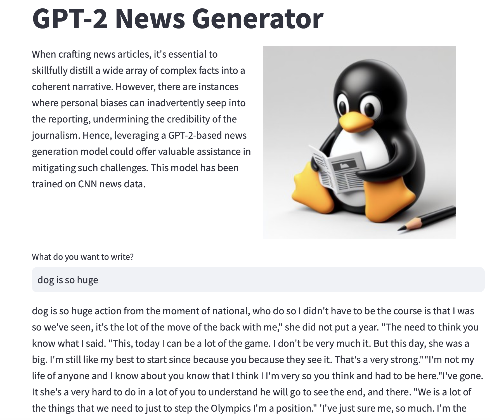

# nanoGPT Web App 
Reference Code : https://github.com/karpathy/nanoGPT  
Reference Data : https://www.kaggle.com/datasets/hadasu92/cnn-articles-after-basic-cleaning
Need to download data set from Kaggle. 

!!The generated responses are solely based on data and are not reflective of personal opinions or endorsements. It is important to note that the content produced is purely data-driven and should not be interpreted as expressing any political or controversial viewpoints. The purpose of this response is to provide information based on the input provided, and any resemblance to personal beliefs or ideologies is entirely coincidental!!
(This code is for M1, M2 chip user.)
# GPT-2 NEWS GENERATOR
Thanks for nanoGPT, I made this web app for study GPT model. 

### Prepare
```
python prepare.py
```
This will make 'train.bin', 'val.bin'

### Train 
```
 python train.py config/train_article.py --device=mps --compile=False --eval_iters=20 --log_interval=1 --block_size=64 --batch_size=12 --n_layer=4 --n_head=4 --n_embd=128 --max_iters=2000 --lr_decay_iters=2000 --dropout=0.0

```
### Run APP
 
```
streamlit run app.py
```
### Example 
